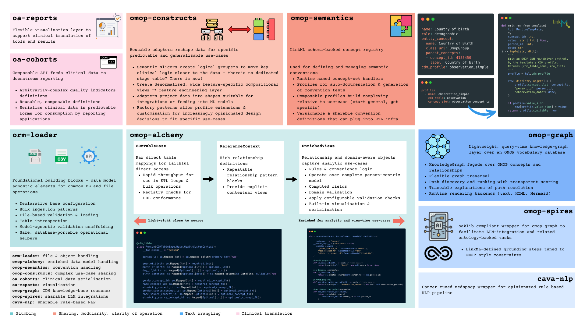

# CaVa System Components

!!! warning
    ``omop-spires`` references not fully populated as the Github page is not yet online

The CaVa ecosystem consists of several specialized modules that extend the functionality of spaCy and Oaklib to handle OMOP-specific clinical tasks.

## spaCy: The ETL Backbone
[spaCy](https://spacy.io/) is the backbone of our processing pipeline. It handles the initial Natural Language Processing (NLP) tasks:

- **Tokenization:** Breaking text into individual units.
- **Pattern Matching:** Identifying known medical terms using rule-based logic.
- **Dependency Parsing:** Understanding the grammatical relationship between words.

!!! info

    While spaCy handles the "flow," our custom components handle the "knowledge". This is part of the **grounding** and is handled in [**`omop-spires`**](#omop-spires). However, this grounding step relies on additional libraries, which are detailed in the following. 

## [``orm-loader``](https://github.com/AustralianCancerDataNetwork/orm-loader): Athena-to-Postgres Ingestor { #orm-loader data-toc-label="orm-loader" }

The **orm-loader** is a high-performance utility designed specifically to ingest **Athena (OHDSI) vocabulary** files into a **PostgreSQL** database. It focuses on speed and reliability by leveraging native database protocols for large-scale clinical datasets.

To handle millions of rows in tables like `concept` and `concept_relationship`, the loader uses optimized bulk patterns:

* **Native COPY Protocol**: Uses PostgreSQL `COPY` commands instead of standard `INSERT` statements to maximize throughput.
* **Pre-Load Validation**: Scans `.csv` files for structural integrity, ensuring correct delimiters and date formats (e.g., `YYYYMMDD`) before the transfer begins.
* **Automated Mapping**: Automatically handles data type conversion and the specific requirements of the CPT4 vocabulary during the load.

### **Key Features**
* **Bulk Ingestion**: Engineered for rapid loading of multi-gigabyte vocabulary bundles.
* **Table Introspection**: Automatically detects the target `CDM_SCHEMA` and manages table truncation or creation.
* **Declarative Setup**: Configured via environment variables for easy integration into existing pipelines.

## [omop-alchemy](https://github.com/AustralianCancerDataNetwork/OMOP_Alchemy): SQLAlchemy Wrapper {#omop-alchemy data-toc-label="omop-alchemy" }
!!! note "Dependencies"
    - [``orm-loader``](#orm-loader): database ingestion and registry management.

`omop-alchemy` is a specialized wrapper for SQL-based OMOP CDM databases. It surfaces tables and attributes in [SQLAlchemy](https://www.sqlalchemy.org/) format, allowing for seamless Pythonic interaction with the OMOP CDM.

- **CDMTableBase**: Provides faithful, direct mappings to the raw OMOP tables.
    * Performance: Optimized for rapid throughput during ETL loops and bulk operations.
    * Validation: Includes registry checks to ensure DDL (Data Definition Language) conformance.
- **ReferenceContext**: Introduces rich relationship definitions to the data model.
    * Structure: Utilizes repeatable relationship pattern blocks.
    * Visibility: Provides explicit contextual views for complex joins.
- **EnrichedViews**: The highest abstraction level, featuring relationship and domain-aware objects.
    * Logic: Incorporates business rules and convenience logic directly into the objects.
    * Validation: Applies configurable validation checks and enforces expected domains (e.g., ensuring Gender concepts are correctly mapped).
    * Functionality: Features computed fields (hybrid properties) and built-in tools for visualization and serialization.
---

## [``omop-graph``](https://github.com/AustralianCancerDataNetwork/omop-graph): Knowledge Graph and Information Retrieval {#omop-graph data-toc-label="omop-graph"}

!!! note "Dependencies"
    - [``omop-alchemy``](#omop-alchemy): OMOP CDM interaction and reference
    - [``orm-loader``](#orm-loader): database ingestion and registry management.

`omop-graph` is a lightweight wrapper designed to facilitate knowledge extraction and graph traversal directly over the OMOP CDM. 

Rather than compiling a heavy, OWL/RDF-compliant Knowledge Graph from OMOP vocabularies, this library implements a **Virtual Knowledge Graph**. It provides the same reasoning capabilities as conventional Knowledge Graphs (KGs) by acting as a semantic translation layer over the existing relational schema.

### Key Features
* **Flexible Graph Traversal:** Efficiently navigate relationships between concepts without complex manual SQL joins.
* **Grounding Capacity:** Robust utilities to resolve non-standard source concepts to their standardized OMOP counterparts.
* **Runtime Rendering:** Built-in backends to visualize graph structures as Text, HTML, or [Mermaid](https://mermaid.js.org/) diagrams.

### Advantages of the VKG Approach
* **Performance:** High-speed reasoning executed directly on relational databases, avoiding the overhead of triple-store query engines.
* **Minimal Footprint:** Eliminates the need for massive, redundant RDF/OWL database files.
* **Zero-Config Integration:** No modification of the OMOP CDM is required. It can be deployed immediately by any institution already utilizing the standard OMOP database structure.

!!! info "Information about Knowledge Graphs"
    Further information on Knowledge Graphs can be found [here](knowledge-graph.md)

---

## [``omop-spires``](https://github.com/AustralianCancerDataNetwork/omop-spires): LLM Grounding { #omop-spires data-toc-label="omop-spires"}

!!! note "Dependencies"
    - [``omop-graph``](#omop-graph): Knowledge Graph traversal and information retrieval from OMOP CDM
    - [``omop-alchemy``](#omop-alchemy): OMOP CDM interaction and reference
    - [``orm-loader``](#orm-loader): database ingestion and registry management.

``omop-spires`` constitutes the advancement of [OntoGPT](https://monarch-initiative.github.io/ontogpt/) to extract structured information from text with Large Language Models (LLMs). The improvements of ``omop-spires`` in combination are the following:

| Component | Logic & Implementation | Key Advantages |
| :--- | :--- | :--- |
| **[Instructor](https://python.useinstructor.com/)** | Structured extraction using LLMs with direct casting to **Pydantic** objects defined by **LinkML** schemas. | **Schema-Conformant:** Ensures initial LLM findings are reproducible and structured. Allows for immediate validation against our clinical data models. |
| **Grounding** | A refined routine facilitated by `omop-graph` that moves beyond simple text retrieval. | **Multi-Strategy:** Incorporates RAG-based grounding, Synonym/Full-text/Partial match resolvers, and algorithmic concept scoring/weighting. |

### Key Features
* **Instructor Integration:** By using Pydantic as the bridge, we treat the LLM as a structured function. This significantly increases the success rate of entity grounding to the OMOP CDM.
* **Intelligent Resolution:** Grounding is no longer a "best guess" string match. By using [`omop-graph`](#omop-graph), the system weights candidates based on their semantic information content.

!!! note "Grounding"
    For more information about grounding, see the [Documentation](inference-grounding.md) and the [``omop-spires`` reference [MISSING]](missing)